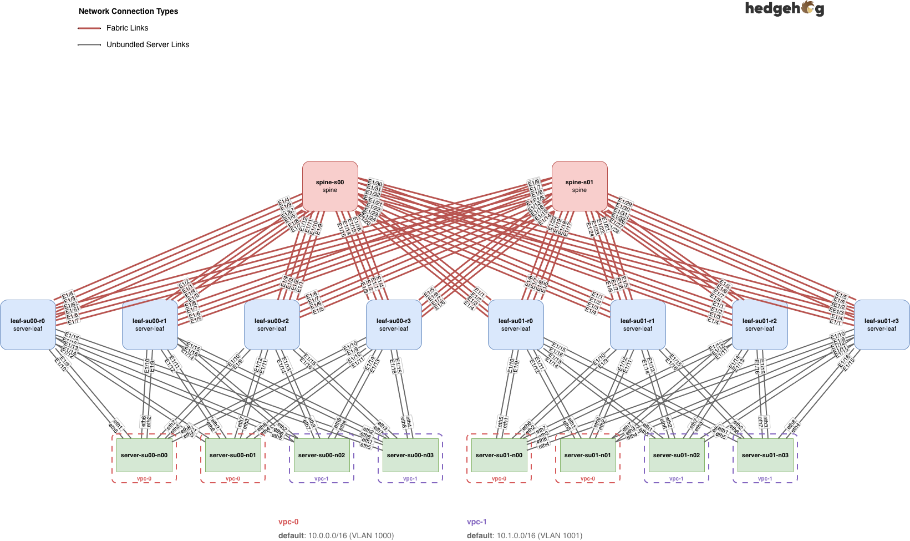

# NVIDIA Air Demo

## Overview



## Guide

0. Using NVIDIA Air 2.0 (air-ngc.nvidia.com) create a new simulation from `topology.yaml` file from this repository,
   keeping ZTP **disabled**
0. Keep OOB enabled and start simulation
0. After it's active, enable SSH in Services tab
    - Provided access info allows to SSH to the Hedgehog Fabric Control Node from which you can ssh to all switches and
      servers using their hostnames
    - SSH keys are automatically provisioned
    - use `admin` username for switches (password: `HHFab.Admin!`)
    - use `ubuntu` username for servers (password: `nvidia`)
    - e.g. ssh `admin@leaf-su00-r0` or `ubuntu@server-su00-n00`
0. Install Hedgehog Fabric
    - SSH to control node (.e.g. `ssh -p 22176 ubuntu@dc5d2f73.workers.ngc.air.nvidia.com`), default password: `nvidia`
    - Clone this repository
    - Prepare node for installing Hedgehog Fabric by running `./0_prepare_control.sh`
    - Relogin to the node (to get PATH and hostname updated)
    - Install Hedgehog Fabric by running `./1_install_control.sh`, it installs K8s and bunch of a software including
      downloading about 1GB of artifacts and so it can take up to 10-20 minutes to complete
    - You should see `INF Control node installation complete` when it's done
    - If it failed you need to run `/opt/bin/k3s-uninstall.sh` and re-run `./1_install_control.sh`
    - Run `./2_setup_servers.sh` to configure rail IPs on all servers
0. Wait for switches to get provisioned
    - Switches will discover control node and do ZTP through DHCP, so it may take another 10-15 minutes before they are
      ready
    - You can check switch status using `kubectl get ag` command and wait for APPLIEDG to become equal to CURRENTG
      column for all switches.

## Summary for control node

Run on the node:

```bash
git clone https://github.com/githedgehog/nvidia-air-demo
cd nvidia-air-demo
./0_prepare_control.sh
```

Relogin and run:

```bash
cd nvidia-air-demo
./1_install_control.sh
./2_setup_servers.sh
```

## Example: ready switches

```bash
ubuntu@control-1:~/nvidia-air-demo$ kubectl get ag
NAME           ROLE          DESCR   APPLIED   APPLIEDG   CURRENTG   VERSION    REBOOTREQ
leaf-su00-r0   server-leaf           14m       12         12         v0-air-2   
leaf-su00-r1   server-leaf           8m9s      12         12         v0-air-2   
leaf-su00-r2   server-leaf           16m       13         13         v0-air-2   
leaf-su00-r3   server-leaf           23m       13         13         v0-air-2   
leaf-su01-r0   server-leaf           17m       19         19         v0-air-2   
leaf-su01-r1   server-leaf           12m       19         19         v0-air-2   
leaf-su01-r2   server-leaf           20m       19         19         v0-air-2   
leaf-su01-r3   server-leaf           25m       19         19         v0-air-2   
spine-s00      spine                 10m       9          9          v0-air-2   
spine-s01      spine                 9m4s      9          9          v0-air-2 
```
